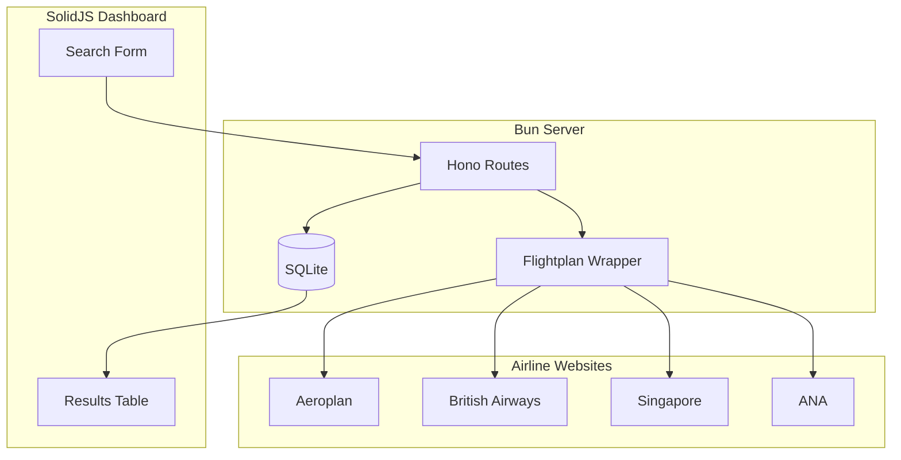

# Flight Points Search Dashboard

A local dashboard to search and cache flight award availability using open-source scraping tools.

## Data Source: Flightplan (Open Source)

Since Seats.aero's free API is limited, we'll use **Flightplan** - an open-source award inventory scraper:

| Feature | Details |
|---------|---------|
| **Cost** | Free (open source) |
| **Method** | Puppeteer/Headless Chrome scraping |
| **Airlines** | Aeroplan, Alaska, British Airways, AsiaMiles, Korean Air, ANA, Qantas, Singapore KrisFlyer |
| **Storage** | SQLite (built-in) |
| **GitHub** | [flightplan-tool/flightplan](https://github.com/flightplan-tool/flightplan) |

> [!WARNING]
> Scraping may violate airline ToS. Use responsibly - the tool mimics human browsing but can run 24/7.

> [!IMPORTANT]
> Some airlines (Aeroplan, AsiaMiles, KrisFlyer) require loyalty program credentials for searches.

---

## Proposed Changes

### Backend - Bun API Server

#### [NEW] [package.json](file:///Users/kwaliu/src/tries/flight_points/package.json)
```json
{
  "dependencies": {
    "flightplan-tool": "^2.x",
    "hono": "^4.x",
    "better-sqlite3": "^11.x"
  }
}
```

#### [NEW] [src/index.ts](file:///Users/kwaliu/src/tries/flight_points/src/index.ts)
Main Bun server entry point:
- Hono HTTP server on port 3000
- Serves static SolidJS build
- Daily cleanup cron for >5 day old data

#### [NEW] [src/db/index.ts](file:///Users/kwaliu/src/tries/flight_points/src/db/index.ts)
SQLite database wrapper:
- Schema with `awards`, `searches` tables
- CRUD operations
- Cleanup function for stale data

#### [NEW] [src/scraper/index.ts](file:///Users/kwaliu/src/tries/flight_points/src/scraper/index.ts)
Flightplan wrapper:
- Initialize engines for enabled airlines
- Queue and execute searches
- Parse and store results

#### [NEW] [src/routes/search.ts](file:///Users/kwaliu/src/tries/flight_points/src/routes/search.ts)
API routes:
- `POST /api/search` - Trigger new search
- `GET /api/results` - Get cached results
- `GET /api/airlines` - List supported airlines
- `DELETE /api/cleanup` - Manual cleanup

---

### Frontend - SolidJS + Vite (Bun)

#### [NEW] [frontend/package.json](file:///Users/kwaliu/src/tries/flight_points/frontend/package.json)
SolidJS with Vite, all using Bun as package manager

#### [NEW] [frontend/src/App.tsx](file:///Users/kwaliu/src/tries/flight_points/frontend/src/App.tsx)
Main app with search form and results display

#### [NEW] [frontend/src/components/SearchForm.tsx](file:///Users/kwaliu/src/tries/flight_points/frontend/src/components/SearchForm.tsx)
- Origin/destination airport inputs
- Date picker
- Cabin class selector (economy/business/first)
- Airline filter checkboxes

#### [NEW] [frontend/src/components/ResultsTable.tsx](file:///Users/kwaliu/src/tries/flight_points/frontend/src/components/ResultsTable.tsx)
- Sortable table with flight results
- Airline logos and badges
- Points/miles display with program name

#### [NEW] [frontend/src/index.css](file:///Users/kwaliu/src/tries/flight_points/frontend/src/index.css)
Modern dark theme with glassmorphism

---

## Architecture



---

## Verification Plan

### Automated Tests
```bash
cd /Users/kwaliu/src/tries/flight_points
bun test
```

### Manual Verification
```bash
# Start backend
cd /Users/kwaliu/src/tries/flight_points
bun run dev

# Start frontend (separate terminal)
cd /Users/kwaliu/src/tries/flight_points/frontend
bun run dev
```

1. Open http://localhost:5173
2. Search: JFK → LHR, any date, business class
3. Verify results appear (may take 30-60s for scraping)
4. Check SQLite has cached entries
5. Search again - should return cached results instantly
